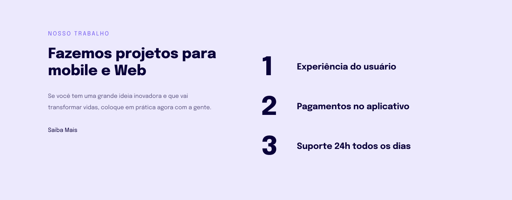

<h1 align="center"> Fazemos projetos mobile e Web </h1>

Este projeto foi desenvolvido a partir de um layout para treinar o que aprendeu até agora no Stage 03.  

## 🚀 Tecnologias

Esse projeto foi desenvolvido com as seguintes tecnologias:

- HTML e CSS
- JavaScript
- Git e Github
- Figma

## 💻 Projeto

Empresa de projetos mobile e Web

## 🔖 Layout

Você pode visualizar o layout do projeto através [DESSE LINK] (https://www.figma.com/file/vPbpcK3SD0poYXkB0vbk1J/Explorer-Stage-03-Projeto-02-(Copy)?node-id=203%3A1800&mode=dev). É necessário ter conta no [Figma] (https://figma.com) para acessá-lo.

## :memo: Licença

Esse projeto está sob a licença MIT.

---

Feito com ♥ by Rocketseat :wave: [Participe da nossa comunidade!] (https://discord.gg/rocketseat)

---

Esse projeto foi realizado pela aluna Kássia Almeida Moura em 2023.
